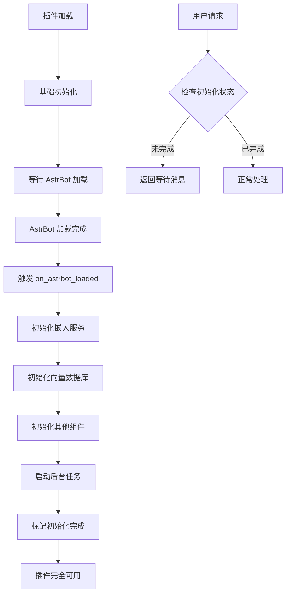

# 插件初始化架构重构指南

## 📋 概述

本文档记录了 Mnemosyne 插件初始化架构的重要重构，将核心组件初始化从插件构造函数转移到 AstrBot 加载完成后的事件钩子中。

## 🎯 重构目标

### 问题背景
在原有架构中，插件在构造函数中立即初始化所有组件，但此时：
- AstrBot 的服务提供商尚未完全加载
- 嵌入服务提供商可能不可用
- 导致插件初始化失败或功能受限

### 解决方案
使用 `@filter.on_astrbot_loaded()` 事件钩子，将核心组件初始化延迟到 AstrBot 完全加载后进行。

## 🔄 架构变更

### 旧架构 (v0.6.0 之前)
```python
def __init__(self, context: Context):
    # 立即初始化所有组件
    self.embedding_adapter = EmbeddingServiceFactory.create_adapter(...)
    self._initialize_vector_database()
    initialization.initialize_components(self)
    # 如果任何组件初始化失败，插件无法启动
```

### 新架构 (v0.6.0+)
```python
def __init__(self, context: Context):
    # 只进行基础初始化
    self.embedding_adapter = None
    self._core_components_initialized = False
    self.logger.info("插件基础初始化完成，等待 AstrBot 加载完成...")

@filter.on_astrbot_loaded()
async def on_astrbot_loaded(self):
    # AstrBot 完全加载后进行核心组件初始化
    await self._initialize_embedding_service()
    self._initialize_vector_database()
    initialization.initialize_components(self)
    await self._start_background_tasks()
```

## 🛠️ 实现细节

### 1. 初始化状态管理
```python
# 状态标志
self._core_components_initialized = False
self._embedding_init_attempted = False

# 检查方法
def _check_initialization(self, event: AstrMessageEvent):
    if not self._core_components_initialized:
        return event.plain_result("⚠️ 插件正在初始化中，请稍后再试...")
    return None
```

### 2. 分阶段初始化
```python
@filter.on_astrbot_loaded()
async def on_astrbot_loaded(self):
    """分阶段初始化核心组件"""
    try:
        # 1. 初始化嵌入服务
        await self._initialize_embedding_service()
        
        # 2. 初始化配置检查
        initialization.initialize_config_check(self)

        # 3. 初始化向量数据库
        self._initialize_vector_database()

        # 4. 初始化其他核心组件
        initialization.initialize_components(self)

        # 5. 启动后台任务
        await self._start_background_tasks()
        
        self._core_components_initialized = True
        
    except Exception as e:
        self.logger.critical(f"插件初始化失败: {e}")
```

### 3. 事件处理保护
```python
@filter.on_llm_request()
async def query_memory(self, event: AstrMessageEvent, req: ProviderRequest):
    # 检查核心组件是否已初始化
    if not self._core_components_initialized:
        self.logger.debug("核心组件未初始化，跳过长期记忆查询")
        return
    
    # 正常处理逻辑
    await memory_operations.handle_query_memory(self, event, req)
```

### 4. 命令处理保护
```python
@memory_group.command("list")
async def list_collections_cmd(self, event: AstrMessageEvent):
    # 检查初始化状态
    init_check = self._check_initialization(event)
    if init_check:
        yield init_check
        return
    
    # 正常命令处理
    async for result in commands.list_collections_cmd_impl(self, event):
        yield result
```

## 📊 初始化流程图



## ✅ 优势

### 1. **更可靠的初始化**
- 确保所有依赖服务都已加载
- 避免因服务不可用导致的初始化失败
- 提供更好的错误处理和恢复机制

### 2. **更好的用户体验**
- 插件不会因为初始化问题而完全无法启动
- 提供清晰的状态反馈
- 支持优雅降级

### 3. **更清晰的架构**
- 分离基础初始化和核心功能初始化
- 明确的依赖关系和初始化顺序
- 更好的可测试性

### 4. **更强的容错性**
- 单个组件初始化失败不会影响整个插件
- 支持重试和恢复机制
- 详细的日志记录

## 🧪 测试验证

### 启动日志分析
```
[14:57:03] 插件基础组件初始化完成，等待 AstrBot 加载完成后进行完整初始化...
[14:57:06] AstrBot 加载完成，开始初始化 Mnemosyne 插件核心组件...
[14:57:06] 成功初始化嵌入服务: AstrBot-Native
[14:57:06] Successfully initialized faiss vector database
[14:57:06] Mnemosyne 插件核心组件初始化成功！
```

### 功能验证
- ✅ 插件成功启动
- ✅ 嵌入服务正确初始化
- ✅ 向量数据库连接成功
- ✅ 所有核心组件正常工作
- ✅ 命令处理正常
- ✅ 事件钩子正常响应

## 📝 最佳实践

### 1. **使用事件钩子进行延迟初始化**
```python
@filter.on_astrbot_loaded()
async def on_astrbot_loaded(self):
    """推荐：在 AstrBot 加载完成后初始化核心组件"""
    pass
```

### 2. **添加初始化状态检查**
```python
def _check_initialization(self, event):
    """推荐：为所有用户交互添加初始化检查"""
    if not self._core_components_initialized:
        return event.plain_result("⚠️ 插件正在初始化中，请稍后再试...")
    return None
```

### 3. **分阶段初始化**
```python
# 推荐：按依赖关系分阶段初始化
# 1. 嵌入服务 (最基础)
# 2. 向量数据库 (依赖嵌入服务)
# 3. 其他组件 (依赖前两者)
# 4. 后台任务 (依赖所有组件)
```

### 4. **优雅的错误处理**
```python
try:
    await self._initialize_component()
except Exception as e:
    self.logger.error(f"组件初始化失败: {e}")
    # 不抛出异常，允许其他组件继续初始化
```

## 🔗 相关文档

- [AstrBot 事件系统文档](https://astrbot.readthedocs.io/zh-cn/latest/develop/event/)
- [插件开发指南](../guides/PLUGIN_DEVELOPMENT.md)
- [嵌入服务适配器](EMBEDDING_ADAPTER.md)
- [向量数据库管理](VECTOR_DATABASE.md)

## 📞 故障排除

### 常见问题

#### Q1: 插件启动后功能不可用
**A**: 检查 `_core_components_initialized` 状态，确认 `on_astrbot_loaded` 是否被正确触发。

#### Q2: 嵌入服务初始化失败
**A**: 检查 AstrBot 的嵌入服务提供商配置，确保在插件初始化前已正确加载。

#### Q3: 命令返回"插件正在初始化中"
**A**: 等待几秒钟让初始化完成，或检查日志中的错误信息。

### 调试技巧

1. **检查初始化日志**
   ```bash
   grep "Mnemosyne" astrbot.log | grep -E "(初始化|initialization)"
   ```

2. **验证事件钩子**
   ```bash
   grep "on_astrbot_loaded" astrbot.log
   ```

3. **检查组件状态**
   ```python
   # 在插件中添加调试命令
   @memory_group.command("debug")
   async def debug_status(self, event):
       status = {
           "core_initialized": self._core_components_initialized,
           "embedding_available": self.embedding_adapter is not None,
           "vector_db_available": self.vector_db is not None
       }
       yield event.plain_result(f"状态: {status}")
   ```

---

*最后更新: 2024-06-23*  
*适用版本: v0.6.0+*
