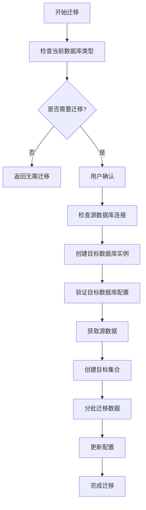

# 配置迁移和数据迁移机制详解

## 📋 概述

Mnemosyne 插件 v0.6.0 提供了完整的配置迁移和数据迁移机制，支持从旧版本配置升级到新版本，以及在不同向量数据库之间迁移数据。

## 🔧 配置迁移机制

### 1. 配置迁移触发方式

#### 自动检测
```python
# 在插件初始化时自动检测
if self.config.get("_migration_version"):
    # 已迁移，无需处理
else:
    # 需要迁移
```

#### 手动触发
```bash
/memory migrate_config
```

### 2. 配置迁移实现

#### 核心逻辑 (`migrate_config_cmd_impl`)
```python
async def migrate_config_cmd_impl(self: "Mnemosyne", event: AstrMessageEvent):
    # 1. 检查是否已经迁移
    if self.config.get("_migration_version"):
        yield event.plain_result("✅ 配置已经是新格式，无需迁移。")
        return

    # 2. 智能检测数据库类型
    if "vector_database_type" not in self.config:
        if self.config.get("milvus_lite_path") or self.config.get("address"):
            self.config["vector_database_type"] = "milvus"
        else:
            self.config["vector_database_type"] = "faiss"

    # 3. 添加 FAISS 配置结构
    if "faiss_config" not in self.config:
        self.config["faiss_config"] = {
            "faiss_data_path": "faiss_data",
            "faiss_index_type": "IndexFlatL2",
            "faiss_nlist": 100
        }

    # 4. 添加嵌入服务配置
    if "embedding_provider_id" not in self.config:
        self.config["embedding_provider_id"] = ""

    # 5. 标记迁移版本
    self.config["_migration_version"] = "0.6.0"
    self.config["_migration_date"] = datetime.now().isoformat()
```

#### 配置结构变更

**旧配置格式**:
```json
{
  "embedding_service": "openai",
  "embedding_model": "text-embedding-ada-002",
  "embedding_key": "sk-xxx",
  "faiss_data_path": "faiss_data",
  "faiss_index_type": "IndexFlatL2",
  "milvus_lite_path": "milvus.db"
}
```

**新配置格式**:
```json
{
  "vector_database_type": "faiss",
  "embedding_provider_id": "硅基凝固",
  "faiss_config": {
    "faiss_data_path": "faiss_data",
    "faiss_index_type": "IndexFlatL2",
    "faiss_nlist": 100
  },
  "milvus_lite_path": "milvus.db",
  "_migration_version": "0.6.0",
  "_migration_date": "2024-06-23T15:30:00"
}
```

### 3. 路径处理机制

#### 自动路径更新 (`_update_config_paths`)
```python
def _update_config_paths(self, config: dict) -> dict:
    # 1. 更新 FAISS 数据路径
    faiss_config = config.get("faiss_config", {})
    if "faiss_data_path" in faiss_config:
        faiss_path = faiss_config["faiss_data_path"]
        if not os.path.isabs(faiss_path):
            # 相对路径转换为基于插件数据目录的绝对路径
            config["faiss_config"]["faiss_data_path"] = os.path.join(
                self.plugin_data_path, faiss_path
            )

    # 2. 更新 Milvus Lite 路径
    if "milvus_lite_path" in config and config["milvus_lite_path"]:
        milvus_path = config["milvus_lite_path"]
        if not os.path.isabs(milvus_path):
            config["milvus_lite_path"] = os.path.join(
                self.plugin_data_path, milvus_path
            )
    
    return config
```

#### 路径处理规则
- **相对路径**: 自动转换为基于 `plugin_data_path` 的绝对路径
- **绝对路径**: 保持不变
- **默认路径**: 如果未配置，使用默认相对路径

## 💾 数据迁移机制

### 1. 数据迁移触发方式

#### FAISS 迁移
```bash
/memory migrate_to_faiss --confirm
```

#### Milvus 迁移
```bash
/memory migrate_to_milvus --confirm
```

### 2. 数据迁移实现

#### 核心迁移逻辑 (`VectorDatabaseFactory.migrate_data`)
```python
@staticmethod
def migrate_data(
    source_db: VectorDatabase,
    target_db: VectorDatabase,
    collection_name: str,
    batch_size: int = 1000,
) -> bool:
    try:
        # 1. 检查源集合是否存在
        if not source_db.has_collection(collection_name):
            logger.error(f"Source collection '{collection_name}' does not exist")
            return False

        # 2. 获取源集合的所有数据
        all_data = source_db.query(
            collection_name=collection_name,
            filters="memory_id >= 0",  # 获取所有记录
            output_fields=["*"],       # 获取所有字段
            limit=None,
        )

        # 3. 获取源集合的 schema
        source_stats = source_db.get_collection_stats(collection_name)
        schema = {
            "vector_dim": source_stats.get("vector_dim", 1024),
            "fields": [],  # 简化的 schema
        }

        # 4. 在目标数据库中创建集合
        if not target_db.create_collection(collection_name, schema):
            logger.error(f"Failed to create target collection '{collection_name}'")
            return False

        # 5. 分批迁移数据
        total_records = len(all_data)
        migrated_count = 0

        for i in range(0, total_records, batch_size):
            batch_data = all_data[i : i + batch_size]
            
            if target_db.insert(collection_name, batch_data):
                migrated_count += len(batch_data)
                logger.info(f"Migrated {migrated_count}/{total_records} records")
            else:
                logger.error(f"Failed to migrate batch {i // batch_size + 1}")
                return False

        return True
    except Exception as e:
        logger.error(f"Data migration failed: {e}", exc_info=True)
        return False
```

#### 迁移流程图


### 3. 异步迁移处理

#### 后台执行
```python
# 在后台执行迁移，避免阻塞用户界面
success = await asyncio.get_event_loop().run_in_executor(
    None,
    lambda: VectorDatabaseFactory.migrate_data(
        source_db=self.vector_db,
        target_db=target_db,
        collection_name=self.collection_name,
        batch_size=1000,
    ),
)
```

#### 进度反馈
```python
# 实时反馈迁移进度
for i in range(0, total_records, batch_size):
    batch_data = all_data[i : i + batch_size]
    if target_db.insert(collection_name, batch_data):
        migrated_count += len(batch_data)
        logger.info(f"Migrated {migrated_count}/{total_records} records")
```

## 🔍 迁移状态检查

### 状态查询命令
```bash
/memory status
```

### 状态检查实现
```python
async def migration_status_cmd_impl(self: "Mnemosyne", event: AstrMessageEvent):
    # 1. 获取当前配置信息
    current_db_type = self.config.get("vector_database_type", "milvus")
    embedding_provider_id = self.config.get("embedding_provider_id", "")

    # 2. 检查数据库连接状态
    db_status = "❌ 未连接"
    if self.vector_db and self.vector_db.is_connected():
        db_status = "✅ 已连接"
        stats = self.vector_db.get_collection_stats(self.collection_name)
        # 显示详细统计信息

    # 3. 检查嵌入服务状态
    embedding_status = "❌ 未初始化"
    if self.embedding_adapter:
        embedding_status = "✅ 已初始化"
        # 显示嵌入服务详细信息

    # 4. 检查迁移版本
    migration_version = self.config.get("_migration_version", "")
    is_migrated = "✅ 已迁移到 v0.6.0" if migration_version else "⚠️ 可能需要迁移"
```

## 🛡️ 安全机制

### 1. 确认机制
- 所有危险操作都需要 `--confirm` 参数
- 提供详细的操作说明和风险提示

### 2. 数据完整性检查
```python
# 迁移前检查
if not source_db.has_collection(collection_name):
    return False

# 迁移后验证
if migrated_count != total_records:
    logger.warning("Migration count mismatch")
```

### 3. 回滚机制
- 保留原始数据直到迁移确认成功
- 提供配置回滚选项
- 详细的错误日志记录

## 📊 迁移性能优化

### 1. 批处理
- 默认批处理大小: 1000 条记录
- 可配置的批处理大小
- 内存使用优化

### 2. 异步处理
- 使用 `asyncio.get_event_loop().run_in_executor()`
- 避免阻塞主线程
- 支持取消操作

### 3. 进度监控
- 实时进度反馈
- 详细的日志记录
- 错误恢复机制

## 🔧 配置验证

### 验证命令
```bash
/memory validate_config
```

### 验证实现
```python
async def validate_config_cmd_impl(self: "Mnemosyne", event: AstrMessageEvent):
    # 1. 验证数据库配置
    db_valid, db_error = VectorDatabaseFactory.validate_config(db_type, self.config)
    
    # 2. 验证嵌入服务配置
    embedding_valid, embedding_error = EmbeddingServiceFactory.validate_config(self.config)
    
    # 3. 检查必要配置项
    required_fields = ["LLM_providers"]
    missing_fields = [field for field in required_fields if not self.config.get(field)]
    
    # 4. 综合评估
    all_valid = db_valid and embedding_valid and not missing_fields
```

## 📝 最佳实践

### 1. 迁移前准备
- 使用 `/memory status` 检查当前状态
- 确保有足够的磁盘空间
- 备份重要配置

### 2. 迁移过程
- 避免在迁移期间进行其他操作
- 监控迁移进度和日志
- 确保网络连接稳定

### 3. 迁移后验证
- 使用 `/memory validate_config` 验证配置
- 检查数据完整性
- 测试基本功能

### 4. 故障恢复
- 查看详细错误日志
- 检查配置文件
- 必要时回滚到原始配置

## 🎯 具体迁移命令实现

### FAISS 迁移命令 (`migrate_to_faiss_cmd_impl`)

```python
async def migrate_to_faiss_cmd_impl(
    self: "Mnemosyne", event: AstrMessageEvent, confirm: Optional[str] = None
):
    # 1. 检查当前数据库类型
    current_db_type = self.config.get("vector_database_type", "milvus").lower()
    if current_db_type == "faiss":
        yield event.plain_result("✅ 当前已经使用 FAISS 数据库，无需迁移。")
        return

    # 2. 确认操作
    if confirm != "--confirm":
        yield event.plain_result(
            "⚠️ 数据迁移确认 ⚠️\n"
            "此操作将把数据从 Milvus 迁移到 FAISS 数据库。\n"
            "迁移过程中请勿进行其他操作。\n\n"
            "如果确定要继续，请执行：\n"
            "`/memory migrate_to_faiss --confirm`"
        )
        return

    # 3. 执行迁移
    try:
        # 创建 FAISS 数据库实例
        faiss_config = self.config.copy()
        faiss_config["vector_database_type"] = "faiss"

        target_db = VectorDatabaseFactory.create_database(
            "faiss", faiss_config, self.embedding_adapter, self.logger
        )

        # 执行数据迁移
        success = await asyncio.get_event_loop().run_in_executor(
            None,
            lambda: VectorDatabaseFactory.migrate_data(
                source_db=self.vector_db,
                target_db=target_db,
                collection_name=self.collection_name,
                batch_size=1000,
            ),
        )

        if success:
            # 更新配置
            self.config["vector_database_type"] = "faiss"
            yield event.plain_result("✅ 数据迁移到 FAISS 完成！")
        else:
            yield event.plain_result("❌ 数据迁移失败，请检查日志。")

    except Exception as e:
        yield event.plain_result(f"❌ 迁移过程中发生错误: {e}")
```

### Milvus 迁移命令 (`migrate_to_milvus_cmd_impl`)

```python
async def migrate_to_milvus_cmd_impl(
    self: "Mnemosyne", event: AstrMessageEvent, confirm: Optional[str] = None
):
    # 类似的实现，但目标是 Milvus 数据库
    current_db_type = self.config.get("vector_database_type", "milvus").lower()
    if current_db_type == "milvus":
        yield event.plain_result("✅ 当前已经使用 Milvus 数据库，无需迁移。")
        return

    # 检查 Milvus 配置
    if not self.config.get("milvus_lite_path") and not self.config.get("address"):
        yield event.plain_result(
            "❌ 缺少 Milvus 配置。请先配置 milvus_lite_path 或 address。"
        )
        return

    # 执行迁移逻辑...
```

## 🔄 自动迁移检测

### 启动时自动检测
```python
def __init__(self, context: Context):
    # 在插件初始化时检测是否需要迁移
    if not self.config.get("_migration_version"):
        self.logger.info("检测到旧版本配置，建议使用 /memory migrate_config 进行迁移")

    # 检测配置结构
    if "faiss_data_path" in self.config and "faiss_config" not in self.config:
        self.logger.warning("检测到旧的 FAISS 配置结构，建议迁移配置")
```

### 兼容性处理
```python
def _ensure_backward_compatibility(self):
    """确保向后兼容性"""
    # 如果使用旧的配置结构，自动转换
    if "faiss_data_path" in self.config and "faiss_config" not in self.config:
        self.config["faiss_config"] = {
            "faiss_data_path": self.config.pop("faiss_data_path"),
            "faiss_index_type": self.config.pop("faiss_index_type", "IndexFlatL2"),
            "faiss_nlist": self.config.pop("faiss_nlist", 100),
        }
        self.logger.info("自动转换旧的 FAISS 配置结构")
```

## 📋 迁移检查清单

### 迁移前检查
- [ ] 当前数据库连接正常
- [ ] 有足够的磁盘空间
- [ ] 备份重要配置文件
- [ ] 确认目标数据库配置正确

### 迁移过程监控
- [ ] 监控迁移进度日志
- [ ] 检查内存使用情况
- [ ] 确保网络连接稳定
- [ ] 避免其他操作干扰

### 迁移后验证
- [ ] 验证数据完整性
- [ ] 测试基本查询功能
- [ ] 检查配置文件更新
- [ ] 确认新数据库连接正常

## 🚨 常见问题和解决方案

### Q1: 迁移过程中断怎么办？
**A**:
1. 检查错误日志确定中断原因
2. 原始数据通常不会被删除
3. 修复问题后重新执行迁移命令
4. 必要时手动清理不完整的目标数据

### Q2: 迁移后数据丢失？
**A**:
1. 检查迁移日志中的记录数量
2. 使用 `/memory list_records` 验证数据
3. 检查目标数据库的集合状态
4. 如果确实丢失，从备份恢复

### Q3: 配置迁移失败？
**A**:
1. 手动检查配置文件格式
2. 使用 `/memory validate_config` 验证
3. 参考文档手动调整配置
4. 重新执行 `/memory migrate_config`

### Q4: 性能问题？
**A**:
1. 调整批处理大小 (batch_size)
2. 检查磁盘 I/O 性能
3. 确保足够的内存
4. 考虑在低峰时段执行迁移

---

*最后更新: 2024-06-23*
*适用版本: v0.6.0+*
